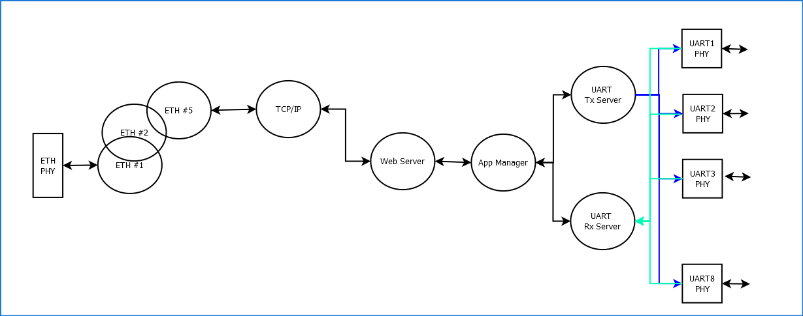
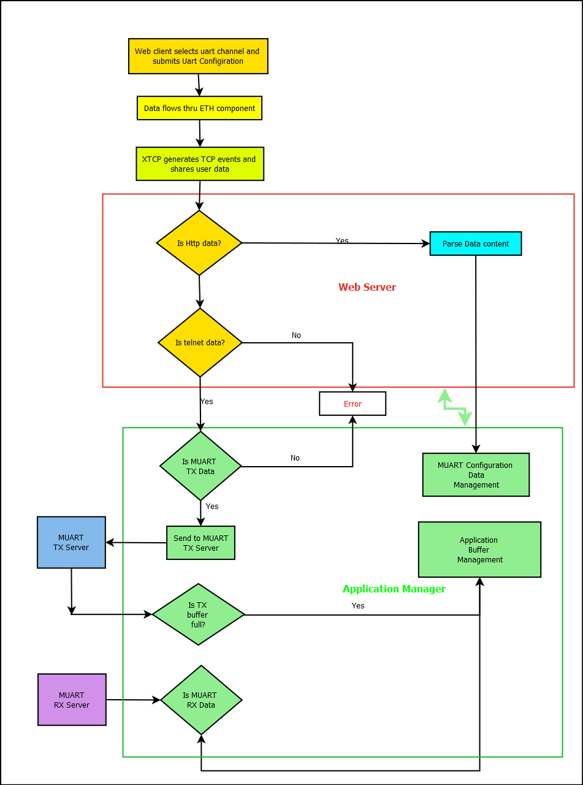
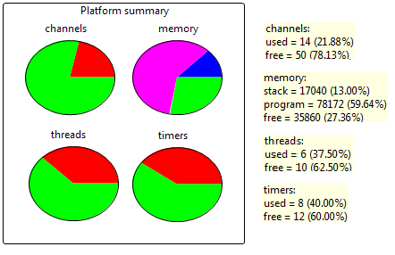

System Overview
===============

This section briefly describes the software components used, thread diagram and data flow for uart configuration and data management.

Thread diagram of s2e app
-------------------------

	 
Software components used
------------------------

   * sc_ethernet
   Two thread version of the ethernet component is used for ethernet communication

   * sc_xtcp
   XTCP component api calls are used for implementing Http and telnet client interfaces

   * sc_multi_uart
   MultiUart transmit and receive server api is used for interfacing the application to MUART component

Description of Operation
++++++++++++++++++++++++

Resource Usage
++++++++++++++

