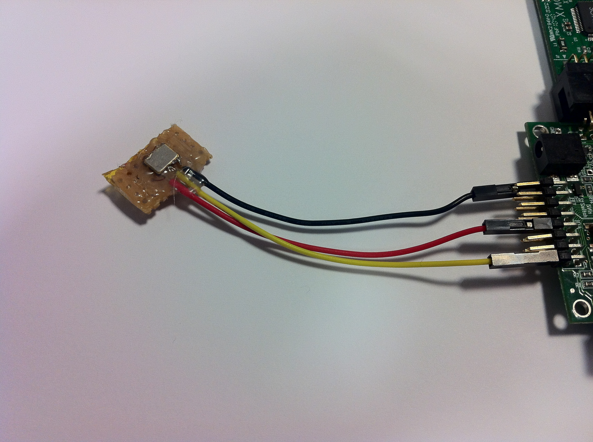
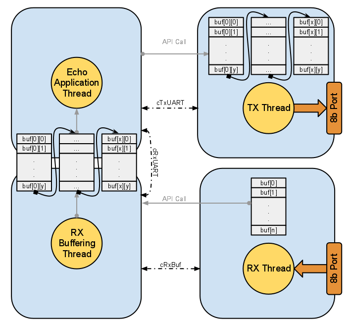

Verification
==============

This section discusses both the demonstration and test applications that are utilised in verification of the multi-UART module. It also deals with the scripts that are utilised to ensure that the UART is operating under a variety of conditions (such as long streams of burst traffic).

Demonstration and Test Applications
~~~~~~~~~~~~~~~~~~~~~~~~~~~~~~~~~~~~

Demo Application Hardware
---------------------------

The echo demonstration application can be run on the XK-1 kit or on the Motor Control Logic Board. The following other parts are required - 

    * External 1.8432MHz oscillator (see :ref:`fig_external_osc_photo`), for more information on clocking see :ref:`sec_ext_clk`.
    * USB to Serial adapter (e.g. FTDI TTL-232R-3V3 from Farnell)
    
.. _fig_external_osc_photo:

    External 1.8432MHz oscillator

The demo applications will build by default for the Motor Control Board. To build for XK-1 you need to make the following changes.

.. list-table::
    :header-rows: 1
    
    * - File
      - Original Value
      - New Value
    * - ``src/main.xc``
      - ``#define UART_CORE 1``
      - ``#define UART_CORE 0``
    * - ``Makefile``
      - ``TARGET = MCB_UART``
      - ``TARGET = XK1_UART``

The IO connections are made to the long connector at the base of the board - labelled JP1. The table in :ref:`table_connector_breakout` shows the IO breakout for the port in relation to the ports that are utilised for the demo applications running with an external oscillator.

.. _table_connector_breakout:

.. table:: Motor Control Board Connector Breakout for Demo & Test Applications 

    +-------------+-----------+--------------------+
    |  XMOS Port  |  JP1 Pin  |   Demo Function    |
    +=============+===========+====================+
    | XS1_PORT_1A |    28     | External Reference |
    +-------------+-----------+--------------------+
    |             |    39     | UART TX Channel 0  |
    |             +-----------+--------------------+
    |             |    40     | UART TX Channel 1  |
    |             +-----------+--------------------+
    |             |    42     | UART TX Channel 2  |
    |             +-----------+--------------------+
    |             |    43     | UART TX Channel 3  |
    | XS1_PORT_8A +-----------+--------------------+
    |             |    44     | UART TX Channel 4  |
    |             +-----------+--------------------+
    |             |    46     | UART TX Channel 5  |
    |             +-----------+--------------------+
    |             |    41     | UART TX Channel 6  |
    |             +-----------+--------------------+
    |             |    45     | UART TX Channel 7  |
    +-------------+-----------+--------------------+
    |             |    19     | UART RX Channel 0  |
    |             +-----------+--------------------+
    |             |    20     | UART RX Channel 1  |
    |             +-----------+--------------------+
    |             |    22     | UART RX Channel 2  |
    |             +-----------+--------------------+
    |             |    23     | UART RX Channel 3  |
    | XS1_PORT_8C +-----------+--------------------+
    |             |    24     | UART RX Channel 4  |
    |             +-----------+--------------------+
    |             |    47     | UART RX Channel 5  |
    |             +-----------+--------------------+
    |             |    21     | UART RX Channel 6  |
    |             +-----------+--------------------+
    |             |    NC     | UART RX Channel 7  |
    +-------------+-----------+--------------------+

Demo Application Configuration
--------------------------------

The demo application can be compiled and run in two different modes.

    * Simple Transmit & Receive Mode

        * This mode of operation produces an application that constantly outputs a string on each UART channel. On the receive side the application will print out via the JTAG interface any characters it receives. This can be looped back by connecting the physical pins together for testing.
        
    * Echo Test Mode
    
        * This mode of operation produces an application that operates as an echo device. This therefore echos back any characters that it receives via the same transmit UART channel.
        
Configuration is done utilising the defines listed out below.

.. literalinclude:: app_multi_uart_demo/src/main.xc
    :start-after: //:demo_app_config
    :end-before:  //:
    
**LOOP_REF_TEST**

    This configures the tests with internal clocking only. This means that no external clock source is required to conduct testing. However it will only operate at multiples the internal reference clock (e.g. 100000 bps).
    
**ECHO_TEST**

    Build the software to run the echo test demo application.
    
**SIMPLE_TEST**

    Build the simple test application
    
**SIMPLE_TEST_DO_RECONF**

    Enable reconfiguration on the simple test application - after a specified time within the application the UART will be reconfigured for a different baud rate.
    
Echo Test Application Description
-----------------------------------

The Echo Test demonstration application shows a typical structure of an application that might be implemented by the user of this module. The diagram in :ref:`fig_echo_struct` shows the structure of the demonstration application.

In addition to the two multi-UART threads the application utilises two further threads - one providing buffering for the UART RX and one handling to the pushing of data to the TX buffer. The RX buffering is implemented as an example only and is not strictly necessary in this application as the TX thread already provides some buffering.

When the RX thread receives a character over the UART it saves it into the local single entry buffer and puts a data token into the channel. This data token is received by RX buffering thread and tells it which UART channel a character has been received on. The RX buffering thread then grabs this character out of the buffer slot, validates it utilising the provided validation function and inserts it into a larger, more comprehensive buffer.

The TX thread operates by polling the buffer between the RX buffering thread and the Echo Application thread. When an entry is seen it pulls it from the buffer and utilises the API to push the value into the TX thread buffer. From there the TX thread will send that value on the correct UART channel on the 8 bit port.

The channel for the TX thread is primarily used for reconfiguration. This is discussed in more detail in :ref:`sec_reconf_rxtx`.

Specific usage of the API is discussed in :ref:`sec_interfacing_tx` and :ref:`sec_interfacing_rx`.

.. _fig_echo_struct:

    Echo Test Application Structure
    

.. _sec_test:

Module Testing Scripts
~~~~~~~~~~~~~~~~~~~~~~~

The module is provided with a python testing script that utilises the echo test application to verify the operation of the Multi-UART module. It covers two particular traffic types.

    * Simple slow speed character traffic

        * This type of traffic is not dissimilar to manually typed in characters. They will have a pause in the order of milliseconds between each character.
        
    * Burst data traffic
        
        * This form of traffic is more akin to communication between two devices that don't require human input, but streams strings of symbols across the UART interface. This traffic typically has minimal space between the symbols as it will be well buffered.
        
Test Script Use
----------------

The test scripts require a Python environment with PySerial installed (see http://pyserial.sourceforge.net/), as well as a suitable serial device to connect to your hardware.

The tests are provided as part of the component repository in `sc_multi_uart/test/serial_test`.

This python script has a number of command line configuration flags that can be utilised to define the test that you want to carry out. These can be seen by passing the ``-h`` flag to the script. A summary is listed below. 

::

    usage: serial_test.py [-h] [-l] [-t PORTS_FOR_TEST [PORTS_FOR_TEST ...]]
                      [-c CONFIG_STRINGS [CONFIG_STRINGS ...]] [-s SEED]
                      [--echo-test] [--multi-speed-echo-test] [--burst-test]
                      [--multi-speed-burst-test] [--log LOG_FILE]

    XMOS UART Testing System

    optional arguments:
        -h, --help            show this help message and exit
        -l, --list-devices    List available UARTs on this system
        -t PORTS_FOR_TEST [PORTS_FOR_TEST ...]
                        List of UARTs to test (see -l to obtain a full list of
                        available ports)
        -c CONFIG_STRINGS [CONFIG_STRINGS ...]
                        List of configurations in the format baud-bits-parity-
                        stop_bits e.g for 115200 bps with 8 bit characters,
                        even parity and 1 stop bit you would use 115200-8-E-1.
                        Valid parity is N-none, M-mark, S-space, E-even,
                        O-odd. Default configurations will be 115200-8-E-1
        -s SEED, --seed SEED  
                        Integer seed for psuedo random tests - if not given
                        then a random seed will be used and reported
        --echo-test     Do the simple echo test at a single speed
        --multi-speed-echo-test
                        Do the simple echo test at multiple speeds using the
                        auto-reconfiguration command to halve the baud rate
        --burst-test    Do the simple burst test at a single speed
        --multi-speed-burst-test
                        Do the burst test at multiple speeds using the auto-
                        reconfiguration command to halve the baud rate
        --log LOG_FILE  File name for failure logging

To find the names for the UART devices that are connected to the machine you are operating on run the following command.

::
    
        > python serial_test.py -l
        Available Serial ports - 
            /dev/tty.Bluetooth-PDA-Sync
            /dev/tty.Bluetooth-Modem
            /dev/tty.usbserial-FTFLQAFM

The host machine we are using has two serial bluetooth devices and a USB to Serial adapter connected (``/dev/tty.usbserial-FTFLQAFM``). This is the device will use for our testing in this instance.

To run a simple echo test the following command can be used. This will run a test at 115200 bits per second, with 8 bit data, even parity and a single stop bit (as defined by the configuration).

Multiple UART devices can be passed to the `-t` flag. The respective number of configurations needs to be passed to the `-c` flag.

::
    
    > python serial_test.py -t /dev/tty.usbserial-FTFLQAFM -c 115200-8-E-1 --echo-test
    *-*-*-*-*-*-*-*-*-*-*-*-*-*-*-*-*-*-*-*-*-*-*-*-*-*-*-*-*-*-*-*-*
    Simple Echo Tests...

    ------------------------------------------------------
    Running SIMPLE ECHO test on port /dev/tty.usbserial-FTFLQAFM with config 115200-8-E-1
    /dev/tty.usbserial-FTFLQAFM configured
    Using seed 911979
    Waiting for the UART to make sense... sending 'A'
    .Cleaning up UART buffers

    Running test...
    [######100%########]COMPLETED: 2048 of 2048 PASS: 2048 FAIL: 0
    Simple Echo Test COMPLETED => PASS
    ------------------------------------------------------

The burst tests can be run in a similar manner.

Multiple speed tests can be configured to run. This assumes that the echo test application is set to reconfigure to half the baud rate when an `r` is sent to the device. 

When running a burst test the user may desire that any failed burst tests are logged to a file for later analysis. This can be defined using the `--log` flag.

The test script utilises a pseudo-random data stream. Specific pseudo random tests can be re-run by defining the initial seed value using the `-s` flag.

Simulation Test Plugin
------------------------

Tests can also be conducted on the simulator. A simulator plugin is provided in the ``test/plugin`` directory within the ``sc_multi_uart`` repository. Information on programming plugins can be found in the XMOS tools documentation.

The plugin is designed to target the XK-1 build configuration of the echo server as described above. The plugin is targeted at providing a debug methodology and as such does not result in a pass/fail. It generates a stream of UART characters to the specified channel. These will be echoed back. The execution trace and also the VCD trace of the output can be analysed to debug any issues that may be encountered.

An example session running the simulator is shown below.

::
    
    > xsim -t --trace-to uart_trace.log --plugin uart_test.so "0 X0D16 0 X0D00" --vcd-tracing "-o uart_sim.vcd -cycles -ports -ports-detailed" ../../app_multi_uart_demo/bin/multi_uart_demo.xe
    
    Initiated UART test plugin...
    Running echo test...
    0 => 115200 bps 8-E-1
    1 => 115200 bps 8-E-1
    2 => 115200 bps 8-E-1
    3 => 115200 bps 8-E-1
    4 => 115200 bps 8-E-1
    5 => 115200 bps 8-E-1
    6 => 115200 bps 8-E-1
    7 => 115200 bps 8-E-1
    RX Buf running
    [1] Generated byte 0xa7 => 0xffffff4e
    Done byte
    [2] Generated byte 0xf1 => 0xffffffe2
    Done byte
    [3] Generated byte 0xd9 => 0xffffffb2
    Done byte
    [4] Generated byte 0x2a => 0xfffffe54
    Done byte
    
This outputs a stream of characters to port 8B, bit 3 (this is the third UART channel) and also provides a port and execution trace for inspection. 

