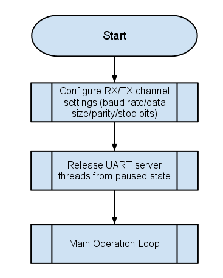

Programming Guide
=================

Getting started
+++++++++++++++

Installation
------------

The following components are required to build the Serial to Ethernet application:
    * sc_multi_uart: git://github.com/xcore/sc_multi_uart.git
    * sc_xtcp: git://github.com/xcore/sc_xtcp.git
    * sc_ethernet: git://github.com/xcore/sc_ethernet.git
    * sc_util: git://github.com/xcore/sc_util.git
    * sc_website: git://github.com/xcore/sc_website.git
    * xcommon: git://github.com/xcore/xcommon.git

Once the zipfiles are downloaded you can install, build and use the software.

Building with the XDE
~~~~~~~~~~~~~~~~~~~~~

To install the software, open the XDE (XMOS Development Tools - latest version as of this writing is 11.11.0) and follow these steps:

#. Choose `File` |submenu| `Import`.

#. Choose `General` |submenu| `Existing Projects into Workspace` and click **Next**.

#. Click **Browse** next to `Select archive file` and select the file firmware ZIP file.

#. Make sure the projects you want to import are ticked in the `Projects` list. Import all the components and whichever applications you are interested in.

#. Click **Finish**.

To build, select `app_serial_to_ethernet` in Project Explorer pane and click the **Build** icon.

Building from the command line
~~~~~~~~~~~~~~~~~~~~~~~~~~~~~~

To build from the command line, change to `app_serial_to_ethernet` directory and execute the command:

::
       xmake all

#. Inorder to build the firmware with user required static IP, execute the following command:

       xmake all STATIC_IP=169.254.196.178

Makefiles
~~~~~~~~~

The main Makefile for the project is in the application directory. This file specifies build options and used modules. The Makefile uses the common build infrastructure in ``xcommon``. This system includes the source files from the relevant modules and is documented within ``xcommon``.

Installing the application onto flash
-------------------------------------

To upgrade (or flash) the firmware you must, firstly:

#. Connect the XTAG Adapter to the Slicekit and XTAG-2 to the adapter. This XTAG-2 can now be connected to your PC or Mac.

#. Switch on the power supply to the hardware board (Slicekit).

Using Command Line Tools
~~~~~~~~~~~~~~~~~~~~~~~~

#. Open the XMOS command line tools (Desktop Tools Prompt), change to 'app_serial_to_ethernet' directory and execute the command:

::
    xmake flash

The serial to ethernet application and associated web pages is now flashed in the XMOS device.

Application Interfaces
+++++++++++++++++++++++

This section provides information on application interfaces.

UART Configuration
------------------

The initialisation and configuration process for both the RX and TX operations is the same. For configuration, the functions :c:func:`uart_config_init` or :c:func:`uart_set_config` are utilised. The flow is visualised in :ref:`fig_uart_init_flow`.

.. _fig_uart_init_flow:

    
    UART Configuration Flow

Flash Interface
---------------

The s2e_flash core handles data to/from flash fitted on board. The UART configuration web (html) pages, UART settings and IP configuration are typically stored into flash. Web pages are retrieved upon request from the client to the web server. UART settings can be 'saved' and 'restored' from flash. They are usually done via:
    * Request from web page (HTTP request)
    * From Telnet configuration server
    * Upon startup (to restore restore last saved settings)
    
IP configuration is saved via UDP server request and is requested from flash upon start-up.

Webserver
---------

The webserver handles all HTTP requests. The web client may request to change UART settings, save current settings, etc... Webserver identifies these requests, validates them and services those requests. It calls appropriate UART handler api's to retrieve and set channel settings. For example, a 'Set' request from web page is validated (the form data from web page containing UART parameters) and the requested channel's configuration is appropriately changed with the new one.
