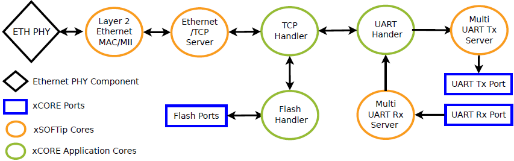

System description
==================

This section briefly describes the software components used, logical cores and resource usage details.

Software architecture
---------------------

    
    Core usage
    
In order to achieve the desired data bridging, this application essentially maps each of the configured UART to a telnet socket and maintains application buffers (FIFOs) for each of such mapping. Whenever there is any UART data available, the `UART Handler` core fills the appropriate UART buffer and notifies `TCP Handler` logical core to consume this data. Similarly whenever there is any data from Ethernet packets, XTCP server avilable in `ETH and TCP/IP` logical core notifies `TCP Handler` logical core, which acts as a TCP client about data availability. `TCP Handler` stores this data into respective application buffers. This data is then consumed by `UART handler` and then pushed to `UART Tx ports` by `UART TX server` logical core.

Cores
~~~~~

The design uses seven logical cores as described below.

The MultiUART component comprises two logical cores, one acting as a transmit (TX) server for up to 8 UARTs, and the other acting as a receive (RX) server for up to 8 UARTs.

UART_handler is an application core that interfaces with the UART RX and TX servers. It handles UART configuration requests, facilitates to store the UART data received from UART RX server into respective application buffers and transfers the data received from TCP clients to UART TX server.

TCP_Handler is another application core that initializes and manages the application. It interfaces with the flash module for UART configuration storage and recovery, handles all the xtcp application events (application data and UI configuration requests) received from the xtcp server module. UDP discovery management, web server handling, telnet data extraction are all implemented in this logical core.

The XTCP server runs on a single logical core and connects to the Ethernet MAC component which uses a single logical core. It uses XC channel to communicate to clients (TCP_Handler in this case) using XTCP events. 

The Flash core handles flash data sotrage and retrieval requests from TCP_handler core based on the application dynamics such as start-up or UI driven requests.

Buffering
~~~~~~~~~

Buffering for the TX server is managed by the UART_handler Core. Data is transferred to the UART TX logical core via a shared memory interface.

There is no buffering provided by the UART RX server. The UART_handler core is able to respond to the received data in real time and store them in buffer(s) available in the  TCP_handler core via token notifcations.

Communication model
~~~~~~~~~~~~~~~~~~~

The ``sc_multi_uart`` module utilises a combination of shared memory and channel communication. Channel communication is used on both the RX and TX servers to pause the logical core and subsequently release the logical core when required for reconfiguration. The primary means of data transfer for both the RX and TX logical cores is via shared memory. The RX logical core utilises a channel to notify any client (UART_handler in this case) of available data - this means that events can be utilised within an application to avoid the requirement for polling for received data.

XTCP module and flash core connects to TCP_handler client using their repective XC channels.

Software components used
------------------------

.. list-table::
 :header-rows: 1

 * - Component
   - Description
 * - sc_ethernet
   - Two logical core (lite) version of the ethernet component implementing 10/100 MII Ethernet MAC and filters
 * - sc_xtcp
   - Micro TCP/IP stack for use with sc_ethernet component
 * - sc_multi_uart
   - Component for implementing multiple serial device communication
 * - sc_util
   - General utility modules for developing for XMOS devices
 * - sc_website
   - Component framework for Embedded web site development
 * - sc_slicekit_support
   - sliceKIT library to use L-series core board's flash for application
 * - sc_otp
   - Library for reading MAC from sliceKIT core board's OTP memory

Resource usage
--------------

.. figure:: images/resource_usage.jpg
    
    Resource usage
    
