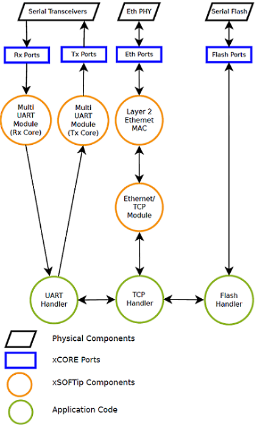

Introduction
------------
A 'Serial to Ethernet' (referred to as S2E) application is typically used to connect legacy serial interfaces to Ethernet based networks. S2E is mainly a bridging application which manages data communication between Serial devices at one end and Ethernet based devices at the other end. Data transfer can be initiated at either end and can be full duplex. This solution offers flexibility in terms of bridging multiple Serial devices (up to 8 UARTs) to an Ethernet interface.

Features
++++++++
* Supports up to 8 serial (UART) ports
* 10/100 Mbit Ethernet interface
* Web UI for UART configuration
* Telnet server functionality: data transfer via a dedicated telnet socket for each UART
* Flash support for UART configuration and web page file system management
* Device discovery and device IP configuration management using UDP
* CMOS/TTL level and RS232 level communication for UARTs

Where it is applicable?
+++++++++++++++++++++++
* Data acquisition and control
* Remote monitoring
* Serial extenders
* Automation systems

Design
------

S2E application maintains an active mapping between each UART port and its corresponding telnet socket. By default, this application utilizes all 8 UARTs and maps them to their respective telnet ports.
Data from either direction is buffered by the application cores and sent to the other direction by utilizing this 'port and socket mapping' configuration.
Hence amount of buffering (buffer depth) and data processing time play vital role in efficient data transfers. By data processing time, we mean how quickly the data available at one end is consumed by the device at other end; this may be dependent on several parameters. For serial transfers, UART configuration parameters such as baud rate, stop bits, flow control options are the key factors; for Ethernet transfers, mode of transport, flow control (inherent in TCP), host TCP/IP stack, a suitable network topology are some of the key factors to determine how efficiently the data may be bridged.

We use the following components (software libraries and driver layer functionality) in this application:

.. list-table::
 :header-rows: 1

 * - Component
   - Usage and purpose
 * - sc_multi_uart
   - Implements Multi UART server to support up to 8 UARTs
 * - sc_ethernet
   - Implements standard 10/100 Mbps MII interface
 * - sc_xtcp
   - Implements TCP/IP stack based on uIP port
 * - sc_util
   - Utility package for inter-core data communication
 * - sc_website
   - Implements web server functionality to support web page file system management
 * - sc_slicekit_support
   - Support package for sliceKIT modular hardware development platform
 * - sc_otp
   - MAC reading library for Ethernet interface

Logical cores usage
+++++++++++++++++++

    
    Logical core usage

Application cores and its functions
+++++++++++++++++++++++++++++++++++
MultiUART interfacing comprises two logical cores, one acting as a transmit (TX) server and the other acting as a receive (RX) server. We use an external clock to derive the timing required to support baud rate up to 115200 bits per second for up to 8 UARTs.

UART_Handler is an application core that handles UART configuration, interfaces to UART servers (MultiUART Module), and manages application buffers and key data structures. As it is of great importance not to lose any data received from UART servers (MultiUART Module), this core implements a double buffer to manage data received from each UARTs.

TCP_Handler is an application core that acts as client to xtcp server (Ethernet/TCP Module) and handles all xtcp application events. It initializes the application, interfaces with the flash module for UART configuration, invokes respective application handlers for parsing Telnet data, and handles web page requests and device discovery messages. This acts as the control core for the whole application in terms of data managing data transfers from Telnet sockets and UART interfaces.

XTCP server (Ethernet/TCP Module) runs on a single logical core and connects to the Ethernet MAC (Layer 2 Ethernet MAC) component which uses another single logical core.

Flash core handles TCP_handler requests for UART configuration storage and retrieval.

Communication model between logical cores
+++++++++++++++++++++++++++++++++++++++++

.. list-table::
 :header-rows: 1

 * - Cores
   - Communication mode
   - Usage
 * - L2 Ethernet MAC, Ethernet/TCP
   - Channel
   - Communicates MII data from Ethernet packets to/from XTCP core
 * - Ethernet/TCP, TCP_Handler
   - Channel
   - Telnet application data to TCP_Application Core
 * - TCP_Handler, UART_Handler
   - Channel
   - Command handling for data communication
 * - TCP_Handler, UART_Handler
   - Shared memory
   - Data buffers to hold UART data and Telnet data
 * - UART_Handler, MultiUART(TX)
   - Shared memory
   - API level data sharing
 * - UART_Handler, MultiUART(RX)
   - Shared memory
   - API level data sharing
 * - Flash_Handler, TCP_Handler
   - Channel
   - UART configuration data, IP address, Web pages to be stored/retrieved from flash memory

Application tuning 
------------------

Key files
+++++++++

.. list-table::
 :header-rows: 1

 * - File
   - Description
 * - ``xtcp_client_conf.h``
   - Configuration parameters to XTCP stack. Defines TCP 'send' buffer size and UIP send and receive buffer sizes
 * - ``s2e_conf.h``
   - Configuration parameters to define UART 'receive' buffers and software flow control options
 * - ``multi_uart_rx_conf.h``
   - Configuration parameters to control MultiUART RX server configuration
 * - ``multi_uart_tx_conf.h``
   - Configuration parameters to control MultiUART TX server configuration

Configuration tuning
++++++++++++++++++++

This section defines the key configuration parameters that may need to be modified in order to tune the application to more specific needs

 **UIP_CONF_RECEIVE_WINDOW**

  -  source: xtcp_client_conf.h
  -  Default value = 128
  -  Size of the advertised receiver's window for incoming XTCP packets

 **UIP_PACKET_SPLIT_THRESHOLD**

  -  source: xtcp_client_conf.h
  -  Default value = 64
  -  Packets above this size will be split during TCP transmits (to avoid delayed acks)

 **UIP_SINGLE_THREAD_RX_BUFFER_SIZE**

  -  source: xtcp_client_conf.h
  -  Default value = 14000
  -  Buffer size to hold incoming receive packets from Ethernet MII layer

 **UIP_MAX_TRANSMIT_SIZE**

  -  source: xtcp_client_conf.h
  -  Default value = 1350
  -  Maximum buffer size (MTU) for TCP transmit packets 

 **XTCP_CLIENT_BUF_SIZE**

  -  source: xtcp_client_conf.h
  -  Default value = 1300
  -  Defines buffer size to hold packets for TCP transmissions

 **UART_RX_MAX_PACKET_SIZE**

  -  source: s2e_conf.h
  -  Default value = 1100
  -  Maximum size of application buffers to collect data received from UARTs

 **UART_RX_MIN_PACKET_SIZE**

  -  source: s2e_conf.h
  -  Default value = 800
  -  This value determines the size of TCP transmit packets

 **SW_FC_CTRL**

  -  source: s2e_conf.h
  -  Default value = 1
  -  Enable this to include `software flow control` for all the conigured UARTs

 **ETHERNET_USE_TRIANGLE_SLOT**

  -  source: ethernet_conf.h
  -  Default value = 1
  -  Use different define according to the usage of Ethernet sliceCARD slot; eg, for STAR slot, use ETHERNET_USE_STAR_SLOT

 **UART_RX_CHAN_COUNT**

  -  source: multi_uart_rx_conf.h
  -  Default value = 8
  -  Number of UARTs to support by MultiUART RX server. Must be a power of 2 (i.e. 1,2,4,8)

 **UART_TX_CHAN_COUNT**

  -  source: multi_uart_tx_conf.h
  -  Default value = 8
  -  Number of UARTs to support by MultiUART TX server. Must be a power of 2 (i.e. 1,2,4,8)
    
 **UART_TX_BUF_SIZE**

  -  source: multi_uart_tx_conf.h
  -  Default value = 8
  -  UART buffer size maintained at MultiUART TX server. Must be a power of 2 (i.e. 1,2,4,8,16,32 etc)
    
API design and overview
------------------------

Refer to ``API`` section of ``Serial to Ethernet bridging application manual`` for available API's and its usage

Points to note
--------------
.. warning:: Hosts with long TCP/IP response times, or large latency due to switches will result in data loss. In such cases, use traffic/network analysis tools such as Wireshark to verify host and device response times. As a thumb rule, the `TCP round trip time time` to send and receive an acknowledgement for a transmitted UART buffer should not exceed the UART buffer filling time. Application buffers may need to be increased as a result to avoid such data losses. Refer to FAQ section for more details.
  
.. note:: This application uses XS1-L8-128 device. Two tile devices provide more room for larger application buffers to accomodate slow hosts, more scope to add more custom functionality in the available spare logical core(s). They also provide additional IO ports to cater to the hardware needs such as hardware flow control etc.,

FAQs
----

  * Data is lost when transferring data across different connections!

  If data is lost during simultaneous data transfers over several serial and Ethernet connections, the application parameters may be tuned to get more stability. 
  Following steps should be of help to deal with data loss:
  
    #. Connect xTAG-2 debug adapter to the ``XP-SKC-L2`` sliceKIT core board and ensure `XMOS Link` switch is `ON`
    #. Enable `S2E_DEBUG_OVERFLOW` parameter available in `s2e_conf.h` file; use xscope debug and observe if there are any '!' prints in the console. In such a case, application buffers to collect data from UARTs are overflowing. Tuning (increasing) `UART_RX_MAX_PACKET_SIZE` value should avoid such a data loss. 
    #. If there is still a data loss, tune the software flow control parameters available under `SW_FC_CTRL` in `s2e_conf.h` Modify `UART_RX_MAX_WATERMARK` and `UART_RX_MIN_WATERMARK` values for better stability. Ensure value of `UART_RX_MAX_WATERMARK` > `UART_RX_MIN_PACKET_SIZE`
    
  * Can I implement hardware flow control in the existing application?

  Yes, this is possible. It requires additional 8 pairs of RTS and CTS pins for flow control. MultiUART TX server module (run_multi_uart_tx) might need to check CTS assertion status before outputting to the UART port. MultiUART RX server has no more MIPS to accommodate any additional logic and hence application core should manage RTS assertion states.

  * Is it possible to extend the design to other series of devices?
 
  Yes, more core devices may be used, but the following needs to be factored into the implementation:

  #. MultiUART server cores (run_multi_uart_tx and run_multi_uart_rx) and application handler cores (TCP_Handler and UART_Handler) should all be on a single tile, as they use shared memory
  #. Ethernet related modifications like adding more TCP and/or UDP message handlers may be accomodated by the TCP_Handler core in a similar manner as telnet_config_event_handler and udp_discovery_event_handler functions

  * Can I add custom web pages?
  
  Yes, they can be added. These pages can be stored into the on board flash as well.
  Take a look at the ``sc_website`` and its demo application ``Embedded Webserver Demo (SPI flash)`` available at xSOFTip browser

  * Can I add any additional application logic?
  
  Yes, more logic may be added based on the spare logical core(s) available and interfaced to the existing logical cores using interfaces/channels to achieve any additional functionality.
  
  * How to find IP for s2e device?

  UDP discovery feature is a part of the application used to discover any S2E devices available on the network.
  Refer to ``Using the application`` section of the ``Serial to Ethernet bridging application manual`` for usage details.

  * Getting an exception after modifying few application parameters!
  
  #. Insufficient memory will be reported at build time if the application buffers exceed a certain size. In such cases, check for the default values and modify to a value that suits accordingly
  #. For sc_xtcp related exceptions, check if UIP_MAX_TRANSMIT_SIZE > XTCP_CLIENT_BUF_SIZE; use wireshark tool to dissect network packets and check for any obvious anomalies

  * What is our test methodology?
  
  As a part of testing, we used 1 MB text file to transfer across simultaneous connections (all 8 UARTs and 8 Telnet sockets in duplex communication) and ensured there is no data loss at standard UART configurations.
  
 
References
----------

 #. ``Serial to Ethernet bridging application manual``

 #. ``Serial to Ethernet (S2E) bridging application quickstart guide``

 #. ``MultiUART module usage manual``. XMOS Ltd, 2012.
 
    - https://www.xmos.com/published/multi-uart-module-usage-manual 
